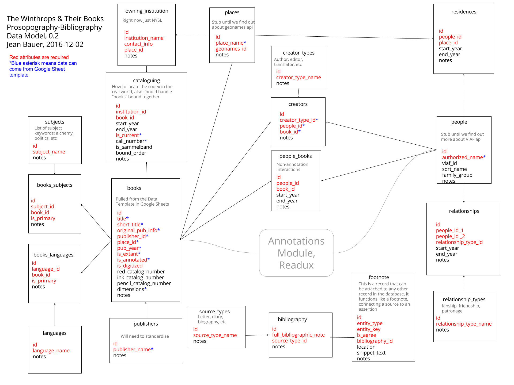
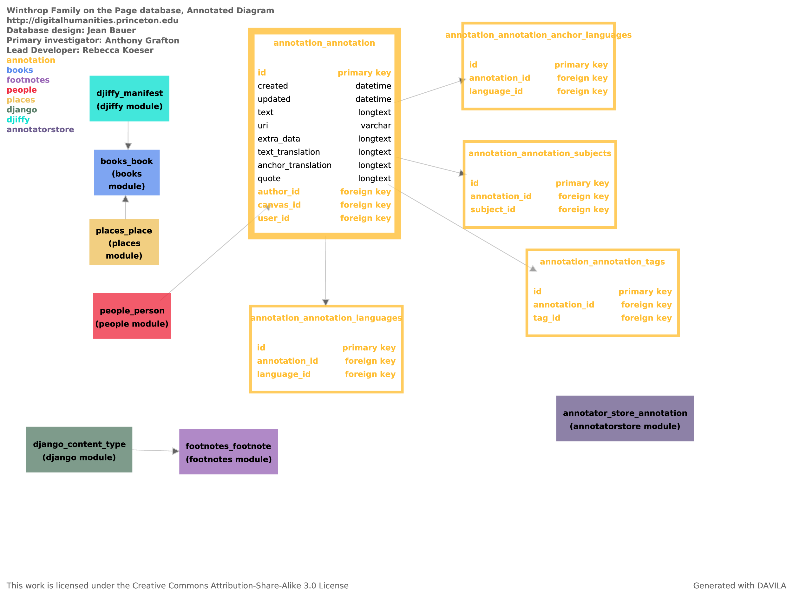
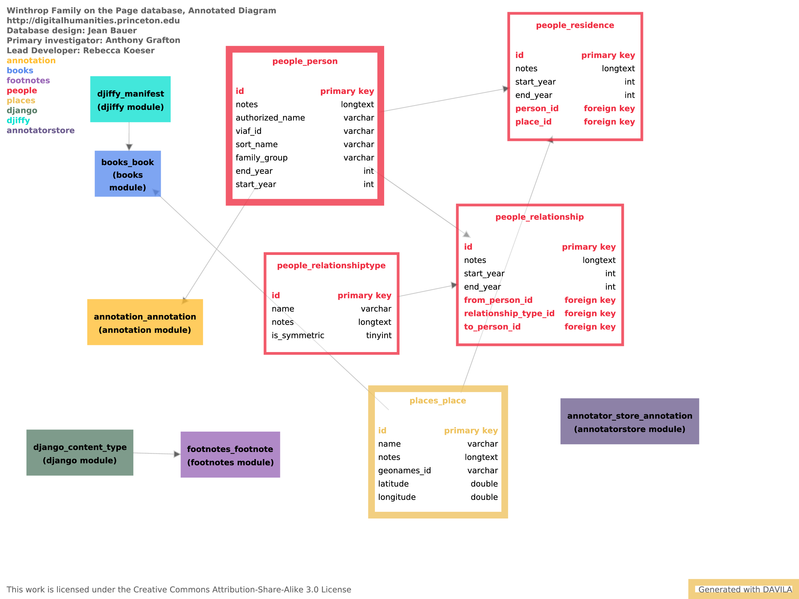
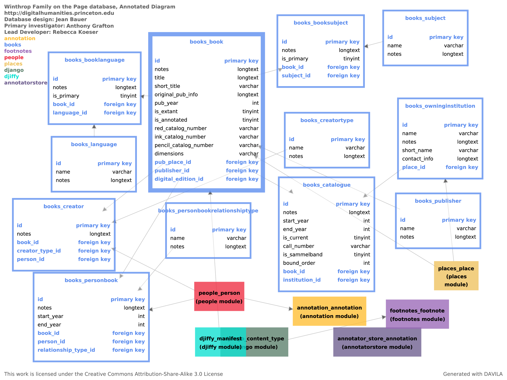

Architecture
============

.. toctree::
   :maxdepth: 2

Database
--------

Database schema design 0.2

DAVILA diagram of database as implemented in Django

.. image:: _static/db-diagram.png
    :target: _static/db-diagram.png
    :alt: DAVILA diagram of bio-biblio database

0.6 Annotation Database Revisions
^^^^^^^^^^^^^^^^^^^^^^^^^^^^^^^^^

Overview of 0.6 schema

.. image:: _static/release-0.6-overview.png
    :target: _static/release-0.6-overview.png
    :alt: Overview of winthrop-django 0.6 schema

Detail view of the annotation module

Detail view of the people and places modules

Detail view of the books module

